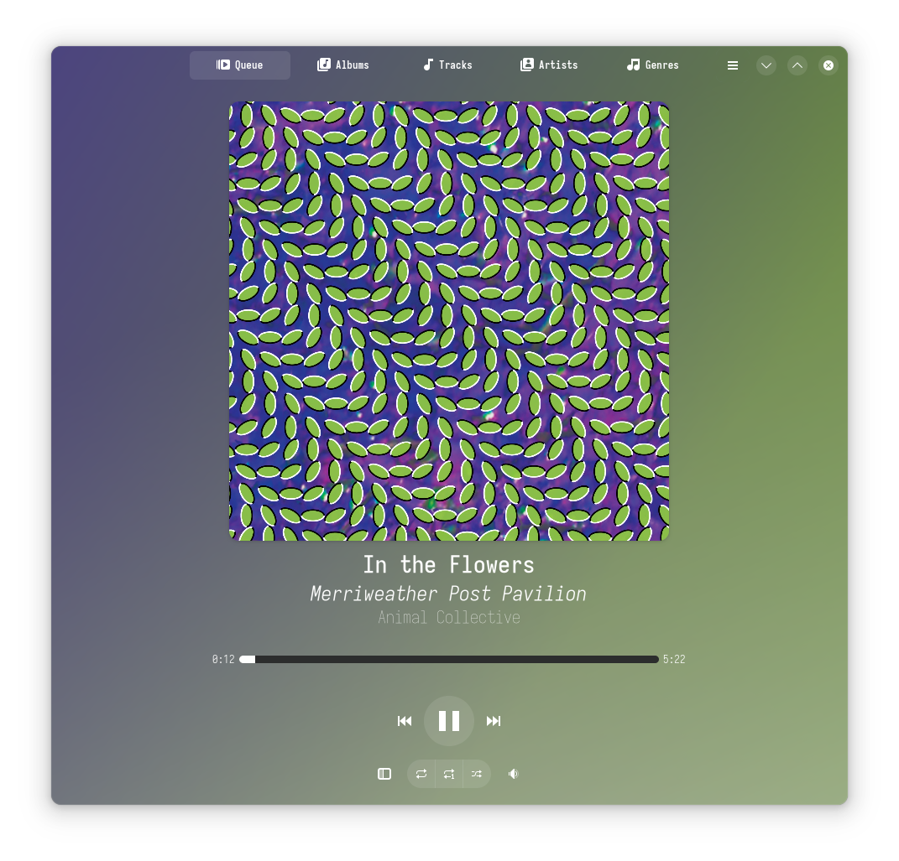

Resonance
======

Harmonize your listening experience with Resonance. 

Resonance is an intuitive music player application written in Rust & Python, with a clean user interface built using GTK4 / Libadwaita. 
Resonance lets you effortlessly manage and play your music collection, with support for all the common music file formats such as MP3, FLAC, AAC, and many more.

  

Features:

 - UI updates to reflect currently playing track's cover art colors
 - Playlist creation & modification
 - Control the player through [MPRIS](https://specifications.freedesktop.org/mpris-spec/latest/)
 - Discord Rich Presence integration
 - Import tags with the [Mutagen library](https://github.com/quodlibet/mutagen)
 - No tag editing (intentionally out of scope to keep Resonance a music player only)

  
<!-- 
 -->

Flatpak
--------------

You can install stable builds of Resonance from [Flathub](https://flathub.org)
by using this command:

    flatpak remote-add --if-not-exists flathub https://flathub.org/repo/flathub.flatpakrepo
    flatpak install flathub io.github.nate_xyz.Resonance

