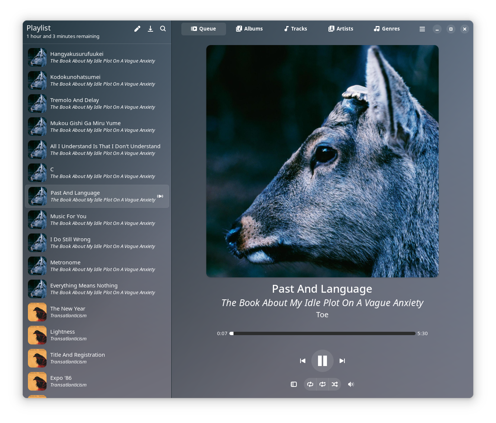
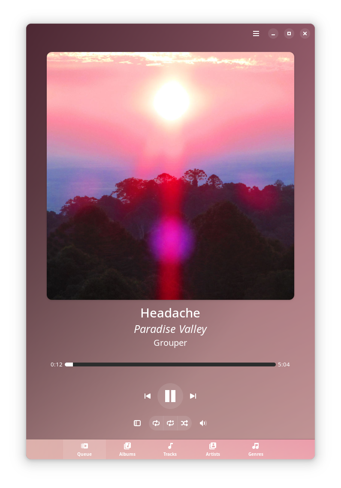
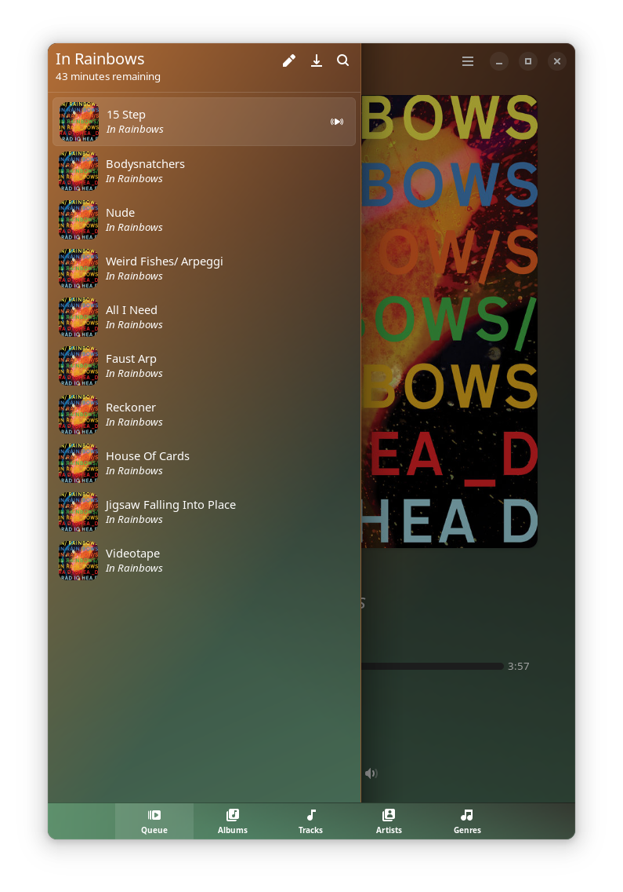
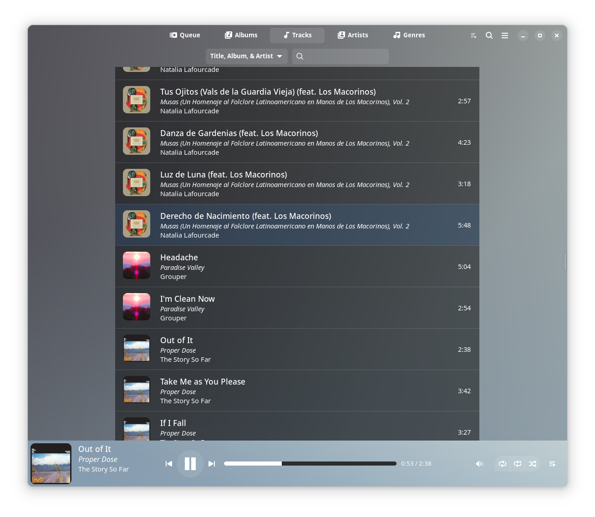
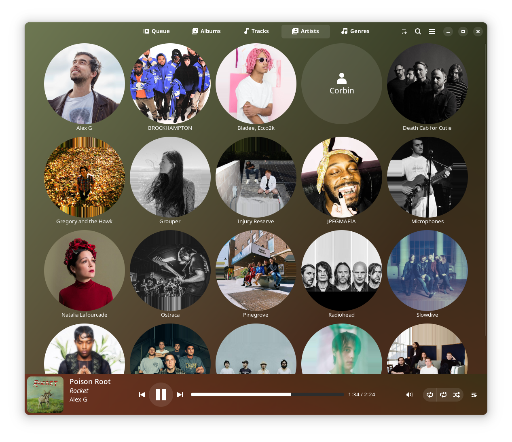
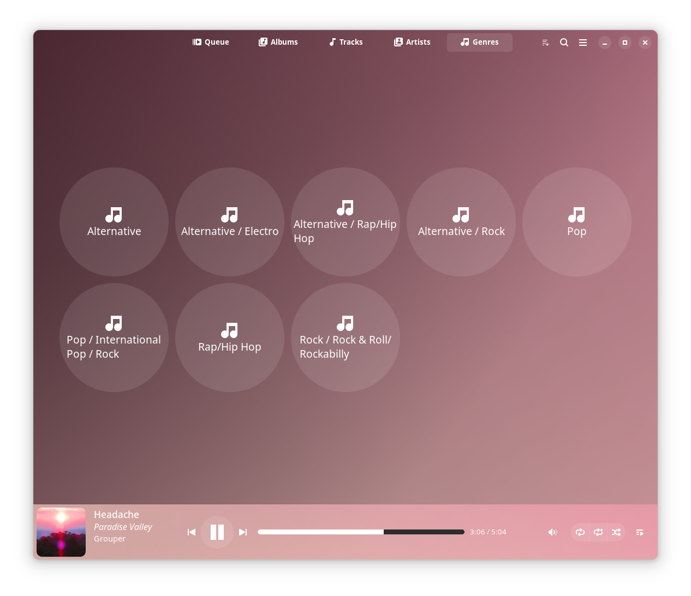

Resonance
======

Harmonize your listening experience with Resonance. 

Resonance is an intuitive music player application written in Rust & Python, with a clean user interface built using GTK4 / Libadwaita. 
Resonance lets you effortlessly manage and play your music collection, with support for all the common music file formats such as MP3, FLAC, AAC, and many more.

⚠️ RESONANCE IS EARLY STAGE ALPHA RELEASE SOFTWARE (THERE ARE BUGS, PLEASE OPEN ISSUES) ⚠️

<br><br>


Features:

 - UI updates to reflect currently playing track's cover art colors
 - Playlist creation & modification
 - Control the player through [MPRIS](https://specifications.freedesktop.org/mpris-spec/latest/)
 - Discord Rich Presence integration
 - Last.fm scrobbling
 - Import tags with the [Mutagen library](https://github.com/quodlibet/mutagen)
 - No tag editing (intentionally out of scope to keep Resonance a music player only)

<br><br>


Flatpak
--------------

You can install stable builds of Resonance from [Flathub](https://flathub.org)
by using this command:

    flatpak remote-add --if-not-exists flathub https://flathub.org/repo/flathub.flatpakrepo
    flatpak install flathub io.github.nate_xyz.Resonance

<a href="https://beta.flathub.org/apps/io.github.nate_xyz.Resonance"></a>

Building from source
----------------------

To build from source you need the gstreamer, gtk4 and libadwaita development headers. Additionally you'll need meson, ninja and git. You'll also need those python runtime libraries: mutagen, tqdm and loguru.

On a recent enough Ubuntu or Debian unstable you can do the following:

```
sudo apt install build-essential rustc meson ninja-build git python3-loguru python3-mutagen python3-tqdm libgtk-4-dev libadwaita-1-dev \
libgstreamer-plugins-bad1.0-dev libgstreamer-plugins-base1.0-dev libgstreamer1.0-dev
git clone https://github.com/nate-xyz/resonance && cd resonance
ninja -C build && sudo ninja -C build install

```
To uninstall run ```sudo ninja -C build uninstall```.

## Arch Linux
Initial script provided for 0.1.3.

Manually download `PKGBUILD` file and run:
```
$ makepkg 
$ sudo pacman -U resonance-0.1.3-1-x86_64.pkg.tar.zst 
```


Screenshots
--------------









